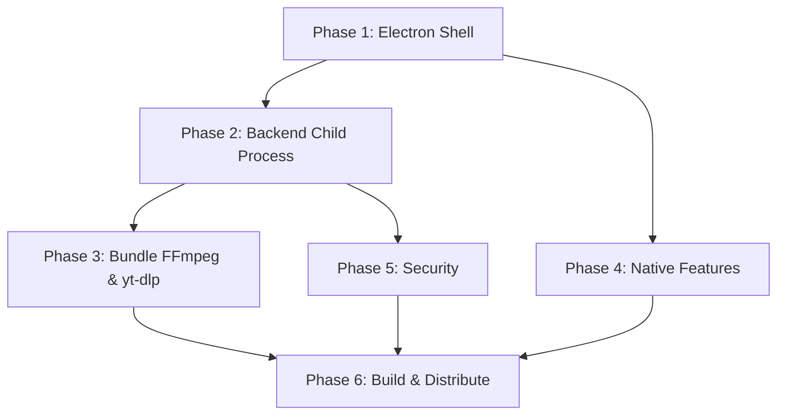

# Feature Plan: Standalone Desktop Application with Electron

> **Goal**: Package the Private Video Downloader as a self-contained desktop application using **Electron**, eliminating the need for users to manually run separate backend and frontend servers.

---

## Current Architecture

```
┌──────────────────┐         HTTP          ┌──────────────────┐
│  Angular 21 SPA  │ ◄──────────────────►  │  FastAPI Backend  │
│  (localhost:4200) │                       │  (localhost:8000) │
│                  │                       │                  │
│  Tailwind CSS    │                       │  yt-dlp + SQLite  │
└──────────────────┘                       └──────────────────┘
     Browser Tab                              Terminal Process
```

**Problem**: Users must install Python, Node.js, and FFmpeg, then run two separate processes. Not user-friendly for non-technical users.

---

## Target Architecture

```
┌─────────────────────────────────────────────────────┐
│                    Electron App                      │
│  ┌───────────────────────────────────────────────┐  │
│  │           BrowserWindow (Renderer)            │  │
│  │     Angular 21 SPA (built & served locally)   │  │
│  └───────────────────────────────────────────────┘  │
│                        │ HTTP (localhost)            │
│  ┌───────────────────────────────────────────────┐  │
│  │          Main Process (Node.js)               │  │
│  │  ┌─────────────┐  ┌────────────────────────┐  │  │
│  │  │ App Lifecycle│  │  Python Child Process  │  │  │
│  │  │  & Tray Icon │  │  (FastAPI + yt-dlp)    │  │  │
│  │  └─────────────┘  └────────────────────────┘  │  │
│  └───────────────────────────────────────────────┘  │
│                                                     │
│  Bundled: Python (embedded), FFmpeg, yt-dlp         │
└─────────────────────────────────────────────────────┘
```

---

## Implementation Phases

### Phase 1 — Electron Shell & Angular Integration

**Goal**: Get the Angular app running inside an Electron window.

#### Tasks

1. **Initialize Electron in project root**
   - Install `electron`, `electron-builder` as devDependencies
   - Create `electron/main.js` — main process entry point
   - Create `electron/preload.js` — secure context bridge

2. **Build Angular for Electron**
   - Modify `angular.json` output path to `dist/renderer/`
   - Set `<base href="./">` in `index.html` for file:// protocol
   - Add `"build:electron"` npm script

3. **Main Process Setup (`electron/main.js`)**
   - Create `BrowserWindow` loading `dist/renderer/index.html`
   - Configure window dimensions, icon, title
   - Handle window close / minimize to tray behavior
   - Set up IPC channels for renderer ↔ main communication

4. **Development Workflow**
   - `npm run dev:electron` — runs `ng serve` + Electron pointing at localhost:4200
   - Hot reload support during development

#### Deliverables
- [NEW] `electron/main.js`
- [NEW] `electron/preload.js`
- [MODIFY] `package.json` (root) — add Electron deps and scripts
- [MODIFY] `frontend/yt-interface/angular.json` — output path
- [MODIFY] `frontend/yt-interface/src/index.html` — base href

---

### Phase 2 — Python Backend as Child Process

**Goal**: Launch the FastAPI server automatically from within Electron.

#### Tasks

1. **Embed Python Runtime**
   - Bundle Python embedded distribution (Windows: `python-embed-amd64.zip`)
   - Store in `resources/python/` inside the app package
   - Include pip and install requirements at build time

2. **Backend Process Manager (`electron/backend.js`)**
   - Spawn Python child process: `python -m uvicorn app.main:app --port 8000`
   - Set CWD to bundled backend directory
   - Capture stdout/stderr for logging
   - Handle graceful shutdown on app quit
   - Health check polling (`GET /health`) before loading UI
   - Auto-restart on crash with configurable retry count

3. **Dynamic Port Allocation**
   - Find available port at startup (avoid conflicts)
   - Pass port to renderer via IPC or environment variable
   - Update `ApiService.base` to use dynamic port

4. **Backend Health Gate**
   - Show splash/loading screen while backend starts
   - Poll `/health` endpoint every 500ms
   - Load main UI only after backend is healthy

#### Deliverables
- [NEW] `electron/backend.js` — Python process manager
- [NEW] `electron/splash.html` — Loading screen
- [MODIFY] `electron/main.js` — integrate backend lifecycle
- [MODIFY] `frontend/yt-interface/src/app/core/api.service.ts` — dynamic base URL

---

### Phase 3 — Bundle FFmpeg & yt-dlp

**Goal**: Include all external dependencies so users don't need to install anything.

#### Tasks

1. **Bundle FFmpeg**
   - Download platform-specific FFmpeg binary
   - Store in `resources/ffmpeg/`
   - Set `ffmpeg_location` in yt-dlp options
   - Update `downloader.py` to use bundled FFmpeg path

2. **Bundle yt-dlp**
   - Install via embedded Python's pip at build time
   - Alternatively bundle as standalone binary
   - Add auto-update mechanism for yt-dlp (important for site compatibility)

3. **Platform-Specific Builds**
   - Windows: `.exe` installer via `electron-builder` (NSIS)
   - macOS: `.dmg` package
   - Linux: `.AppImage` or `.deb`

#### Deliverables
- [NEW] `scripts/bundle-ffmpeg.js` — FFmpeg download script
- [NEW] `scripts/bundle-python.js` — Python embedding script
- [NEW] `electron-builder.yml` — Build configuration
- [MODIFY] `backend/app/downloader.py` — configurable FFmpeg path
- [MODIFY] `backend/app/config.py` — paths relative to app bundle

---

### Phase 4 — Native Desktop Features

**Goal**: Add desktop-native UX features that elevate the experience.

#### Tasks

1. **System Tray Integration**
   - Minimize to system tray instead of closing
   - Tray icon with context menu (Show / Quit)
   - Tray notifications on download completion

2. **Native File Dialogs**
   - "Choose download folder" dialog via `electron.dialog`
   - Open downloaded file in OS file explorer
   - Expose via preload.js using `contextBridge`

3. **Drag & Drop**
   - Allow drag-and-drop of URLs onto the app window
   - Auto-populate URL field and trigger fetch

4. **Clipboard Monitoring (Optional)**
   - Watch clipboard for copied video URLs
   - Prompt user to download when detected

5. **Global Keyboard Shortcuts**
   - `Ctrl+V` to paste and auto-fetch
   - `Ctrl+N` to clear and start new download

6. **Download Progress in Taskbar**
   - Show download progress on Windows taskbar icon
   - Use `BrowserWindow.setProgressBar()`

#### Deliverables
- [NEW] `electron/tray.js` — System tray management
- [MODIFY] `electron/main.js` — tray, dialogs, shortcuts
- [MODIFY] `electron/preload.js` — expose native APIs
- [MODIFY] `frontend/yt-interface/src/app/pages/downloader/downloader.ts` — native integrations

---

### Phase 5 — Security & Auth Refinement

**Goal**: Adapt authentication for single-user desktop context.

#### Tasks

1. **Remove HTTP Basic Auth**
   - In desktop mode, authentication is unnecessary (single-user, localhost-only)
   - Add environment flag `ELECTRON_MODE=true` to skip auth
   - Keep auth available as option for remote/network deployment

2. **Secure IPC**
   - Use `contextBridge.exposeInMainWorld()` for safe IPC
   - Disable `nodeIntegration` in renderer
   - Enable `contextIsolation`

3. **Restrict Network Access**
   - Backend listens on `127.0.0.1` only (no LAN exposure)
   - CSP headers in Electron BrowserWindow

#### Deliverables
- [MODIFY] `backend/app/auth.py` — conditional auth bypass
- [MODIFY] `backend/app/main.py` — CORS for electron:// or file://
- [MODIFY] `electron/main.js` — security settings

---

### Phase 6 — Build, Package & Distribute

**Goal**: Create distributable installers for all major platforms.

#### Tasks

1. **Electron Builder Configuration**
   ```yaml
   # electron-builder.yml
   appId: com.private-video-downloader.app
   productName: Video Downloader
   directories:
     output: release/
   files:
     - dist/**/*
     - electron/**/*
     - backend/**/*
     - resources/**/*
   win:
     target: [nsis, portable]
     icon: assets/icon.ico
   mac:
     target: [dmg]
     icon: assets/icon.icns
   linux:
     target: [AppImage, deb]
     icon: assets/icon.png
   extraResources:
     - from: resources/python/
       to: python/
     - from: resources/ffmpeg/
       to: ffmpeg/
   ```

2. **CI/CD Pipeline**
   - GitHub Actions workflow for multi-platform builds
   - Auto-publish releases with changelog
   - Code signing (Windows & macOS)

3. **Auto-Updates**
   - Integrate `electron-updater` for self-updating app
   - Update server or GitHub Releases as update source
   - Separate yt-dlp updates from app updates

#### Deliverables
- [NEW] `electron-builder.yml`
- [NEW] `.github/workflows/build.yml`
- [MODIFY] `electron/main.js` — auto-updater integration

---

## Dependency Map



---

## New Files Summary

| File | Purpose |
|---|---|
| `electron/main.js` | Electron main process entry |
| `electron/preload.js` | Secure context bridge |
| `electron/backend.js` | Python child process manager |
| `electron/tray.js` | System tray integration |
| `electron/splash.html` | Loading screen while backend starts |
| `electron-builder.yml` | Package/installer configuration |
| `scripts/bundle-ffmpeg.js` | FFmpeg download automation |
| `scripts/bundle-python.js` | Embedded Python bundling |
| `.github/workflows/build.yml` | CI/CD multi-platform builds |

---

## Estimated Timeline

| Phase | Duration | Complexity |
|---|---|---|
| Phase 1: Electron Shell | 1-2 days | Low |
| Phase 2: Backend Process | 2-3 days | Medium |
| Phase 3: Bundle Dependencies | 2-3 days | Medium-High |
| Phase 4: Native Features | 3-4 days | Medium |
| Phase 5: Security | 1 day | Low |
| Phase 6: Build & Distribute | 2-3 days | Medium-High |
| **Total** | **~11-16 days** | |

---

## Risks & Mitigations

| Risk | Impact | Mitigation |
|---|---|---|
| Python bundle size (~100MB) | Large installer | Use embedded Python, strip unused libs |
| FFmpeg binary size (~80MB) | Large installer | Use minimal FFmpeg build |
| yt-dlp site breakage | Downloads fail | Auto-update yt-dlp independently |
| Anti-virus false positives | Blocks install | Code signing certificate |
| Cross-platform path issues | Runtime errors | Use `path.join()`, test on all platforms |
| Python process crash | Backend unavailable | Auto-restart with health checks |
